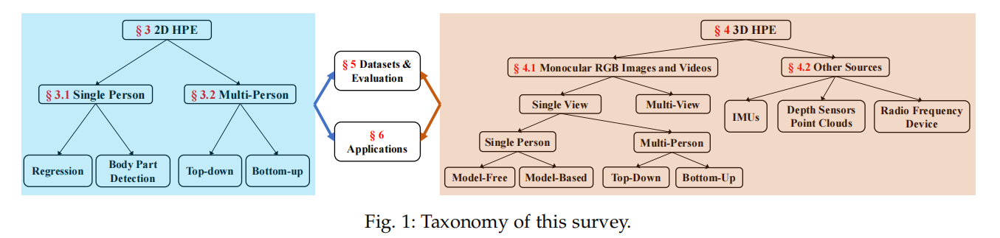

# Deep Learning-Based Human Pose Estimation: A Survey

## Deep Learning-Based Human Pose Estimation: A Survey  [[Paper](https://arxiv.org/abs/2012.13392)]

## Authors 

[Ce Zheng∗](https://zczcwh.github.io/), 
[Wenhan Wu∗](https://sites.google.com/view/wenhanwu/%E9%A6%96%E9%A1%B5), 
[Taojiannan Yang](https://sites.google.com/view/taojiannanyang/home), 
[Sijie Zhu](https://sites.google.com/uncc.edu/sijiezhu/home),
[Chen Chen](https://webpages.uncc.edu/cchen62/),
[Ruixu Liu](https://udayton.edu/directory/engineering/electrical_and_computer/liu-ruixu.php),
[Ju Shen](https://udayton.edu/directory/artssciences/computerscience/shen_ju.php),
[Nasser Kehtarnavaz](https://personal.utdallas.edu/~nxk019000/index.html),
[Mubarak Shah](https://www.crcv.ucf.edu/person/mubarak-shah/).

## Overview
This is the official repository of **Deep Learning-Based Human Pose Estimation:A Survey**, a comprehensive and systematic review of recent deep learning-based solutions for 2D and 3D human pose estimation(HPE). It also presents comparison results of different 2D and 3D HPE methods on several publicly available datasets. Additionally, more than 240 research papers since 2014 are covered and **we will update this page on a regular basis. Please feel free to contact <a href="czheng6@uncc.edu">Ce Zheng</a> or <a href="wwu25@uncc.edu"> Wenhan Wu</a> if you have any suggestions!**

## Introduction
Human pose estimation aims to locate the human body parts and build human body representation (e.g., body skeleton) from
input data such as images and videos. It has drawn increasing attention during the past decade and has been utilized in a wide range of
applications including human-computer interaction, motion analysis, augmented reality, and virtual reality. Although the recently
developed deep learning-based solutions have achieved high performance in human pose estimation, there still remain challenges due to
insufficient training data, depth ambiguities, and occlusions. The goal of this survey paper is to provide a comprehensive review of recent
deep learning-based solutions for both 2D and 3D pose estimation via a systematic analysis and comparison of these solutions based on
their input data and inference procedures. More than 240 research papers since 2014 are covered in this survey. Furthermore, 2D and 3D
human pose estimation datasets and evaluation metrics are included. Quantitative performance comparisons of the reviewed methods on
popular datasets are summarized and discussed. Finally, the challenges involved, applications, and future research directions are
concluded.

### Taxonomy

  

##  [2D HPE paper list](https://github.com/zczcwh/DL-HPE/tree/main/2DHPE)

##  [2D HPE datasets](https://github.com/zczcwh/DL-HPE/tree/main/2D_dataset)

##  [3D HPE paper list](https://github.com/zczcwh/DL-HPE/tree/main/3DHPE)

##  [3D HPE datasets](https://github.com/zczcwh/DL-HPE/tree/main/3D_dataset)

## Citation
If you find our work useful in your research, please consider citing:

     @misc{zheng2020deep,
      title={Deep Learning-Based Human Pose Estimation: A Survey}, 
      author={Ce Zheng and Wenhan Wu and Taojiannan Yang and Sijie Zhu and Chen Chen and Ruixu Liu and Ju Shen and Nasser Kehtarnavaz and Mubarak Shah},
      year={2020},
      eprint={2012.13392},
      archivePrefix={arXiv},
      primaryClass={cs.CV}
     }

## Updates
