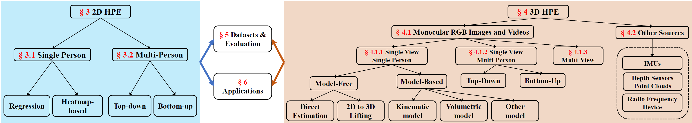

# Deep Learning-Based Human Pose Estimation: A Survey

## Deep Learning-Based Human Pose Estimation: A Survey  [[Paper](https://arxiv.org/pdf/2012.13392.pdf)]

## Authors 

[Ce Zheng∗](https://zczcwh.github.io/), 
[Wenhan Wu∗](https://sites.google.com/view/wenhanwu/%E9%A6%96%E9%A1%B5), 
[Chen Chen](https://www.crcv.ucf.edu/chenchen/),
[Taojiannan Yang](https://sites.google.com/view/taojiannanyang/home), 
[Sijie Zhu](https://jeff-zilence.github.io/),
[Ju Shen](https://udayton.edu/directory/artssciences/computerscience/shen_ju.php),
[Nasser Kehtarnavaz](https://personal.utdallas.edu/~nxk019000/index.html),
[Mubarak Shah](https://www.crcv.ucf.edu/person/mubarak-shah/).

## News
Our ICCV 2021 paper on 3D Human Pose Estimation using Transformers (PoseFormer): [3D Human Pose Estimation with Spatial and Temporal Transformers](https://arxiv.org/pdf/2103.10455.pdf)
[[Code](https://github.com/zczcwh/PoseFormer)]

Our recent CVPR 2023 paper PoseFormerV2: [PoseFormerV2: Exploring Frequency Domain for Efficient and Robust 3D Human Pose Estimation](https://arxiv.org/pdf/2303.17472.pdf)
[[Code](https://github.com/QitaoZhao/PoseFormerV2)]

## Overview
This is the official repository of **Deep Learning-Based Human Pose Estimation:A Survey**, a comprehensive and systematic review of recent deep learning-based solutions for 2D and 3D human pose estimation(HPE). It also presents comparison results of different 2D and 3D HPE methods on several publicly available datasets. Additionally, more than 250 research papers since 2014 are covered and **we will update this page on a regular basis. Please feel free to contact cezheng@knights.ucf.edu or wwu25@uncc.edu if you have any suggestions!**

## Introduction
Human pose estimation aims to locate the human body parts and build human body representation (e.g., body skeleton) from
input data such as images and videos. It has drawn increasing attention during the past decade and has been utilized in a wide range of
applications including human-computer interaction, motion analysis, augmented reality, and virtual reality. Although the recently
developed deep learning-based solutions have achieved high performance in human pose estimation, there still remain challenges due to
insufficient training data, depth ambiguities, and occlusions. The goal of this survey paper is to provide a comprehensive review of recent
deep learning-based solutions for both 2D and 3D pose estimation via a systematic analysis and comparison of these solutions based on
their input data and inference procedures. More than 240 research papers since 2014 are covered in this survey. Furthermore, 2D and 3D
human pose estimation datasets and evaluation metrics are included. Quantitative performance comparisons of the reviewed methods on
popular datasets are summarized and discussed. Finally, the challenges involved, applications, and future research directions are
concluded.

### Taxonomy

  

##  [2D HPE paper list](https://github.com/zczcwh/DL-HPE/tree/main/2DHPE)

##  [2D HPE datasets and performance comparison](https://github.com/zczcwh/DL-HPE/tree/main/2D_dataset)

##  [3D HPE paper list](https://github.com/zczcwh/DL-HPE/tree/main/3DHPE)

##  [3D HPE datasets and performance comparison](https://github.com/zczcwh/DL-HPE/tree/main/3D_dataset)

##  [HPE Applications](https://github.com/zczcwh/DL-HPE/tree/main/Applications)

##  [HPE Workshops and challenges](https://github.com/zczcwh/DL-HPE/tree/main/Workshops)

## Citation
If you find our work useful in your research, please consider citing:

@article{zheng2020deep,
author = {Zheng, Ce and Wu, Wenhan and Chen, Chen and Yang, Taojiannan and Zhu, Sijie and Shen, Ju and Kehtarnavaz, Nasser and Shah, Mubarak},
title = {Deep Learning-Based Human Pose Estimation: A Survey},
year = {2023},
publisher = {Association for Computing Machinery},
address = {New York, NY, USA},
issn = {0360-0300},
url = {https://doi.org/10.1145/3603618},
doi = {10.1145/3603618},
journal = {ACM Comput. Surv.},
month = {jun},
}

## Updates
*  June 2023, Accepted to ACM Computing Surveys.
*  Dec 2022: Add more 2022 papers.
*  Jan 2022: Add more 2021 papers.
*  Dec 2020: Initial release.
